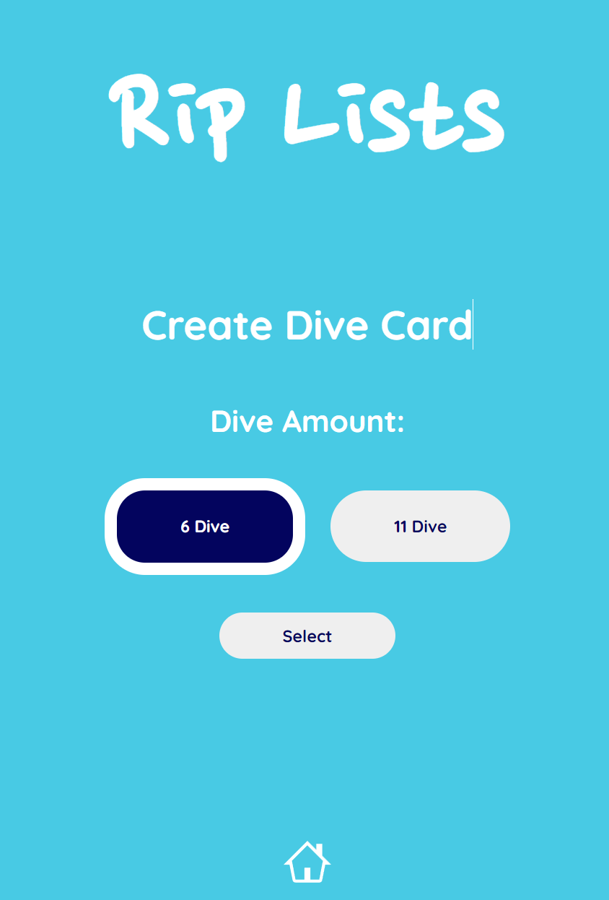
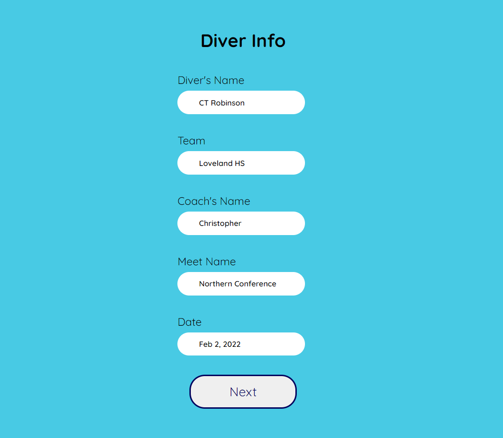
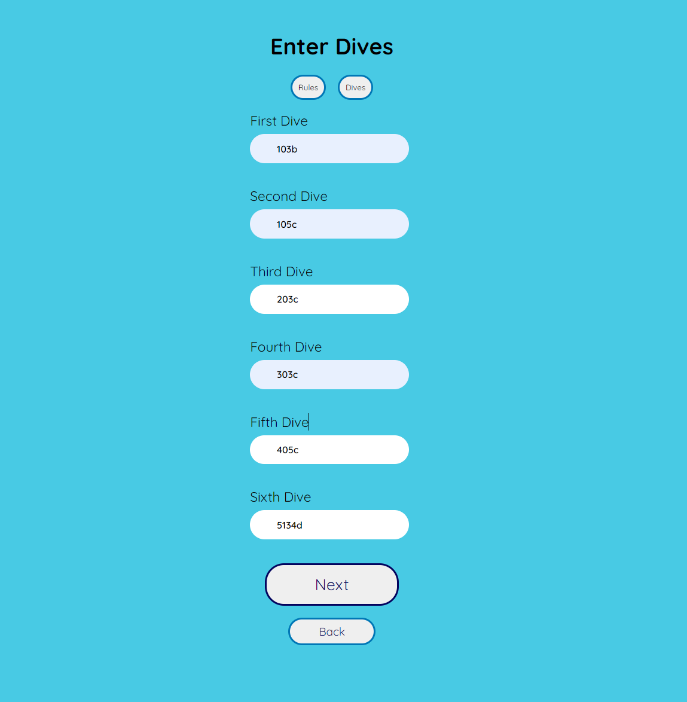
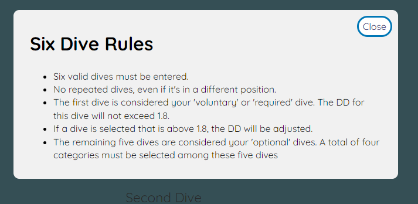
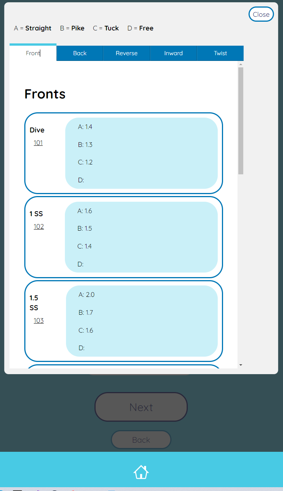
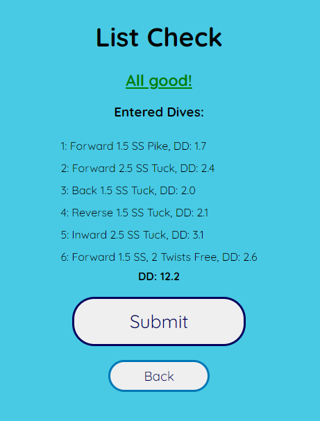
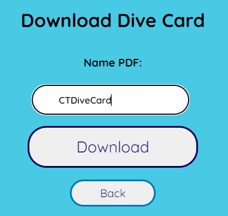
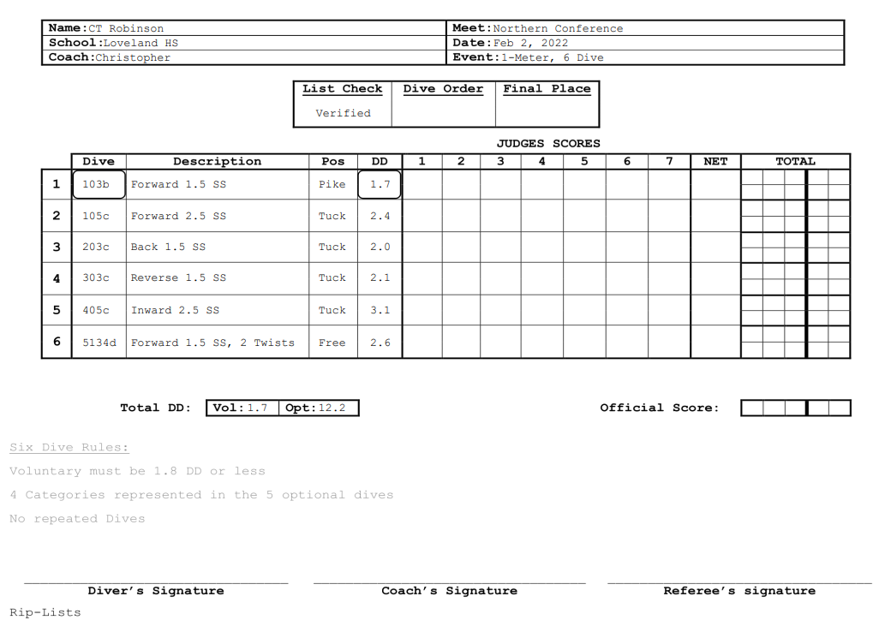

<h1> Rip Lists Read-Me </h1>

<h3>Why make Rip Lists?</h3>
 
Diving is a very niche sport, and when it comes to niche things, it can be hard to find programs to make your life easier. When a diver competes, there are a couple different events they could be competing in and for any of those events, they have rules for what dives you compete or how many you are able to do. At each meet, you are expected to have a dive card for every diver, showing the dives they plan to compete with their information such as direction, number of spins, degree of difficulty, etc. It can get burdensome to hand write dive cards, especially for 11 dive meets when there's a lot of rules associated with that type of meet. Rip Lists is a way for divers or coaches to create and download dive cards for meets and have the peace of mind knowing everything is entered correctly.
 
<h3>How do you use it?</h3>
<h4>Front Page</h4>
 
The front page has two options (for now), 6 or 11 dive meets. For simplicity's sake, we will walk through how to make a 6 dive card.

The first page is pretty self explanatory. You will enter the information of the diver, meet, coach, team, and date.

Next, you will enter the dive numbers you plan to do. In diving, there are numbers that are associated with each dive. The number is broken down into three sections: direction, rotations, and position. For dive number 103b, the "1" indicates that it's a forward direction, the "03" indicates that there's 1.5 rotations (each half rotation adds a whole number), and the "b" tells us that the dive is in a pike position. If people are not familiar with the dive numbers or rules of the event, there's a "Rules" and "Dives" modal that can be looked through to make sure you're entering the correct dive.

<h4>Rules Modal:</h4>

<h4>Dives Modal:</h4>

Once all dives are entered, you can submit your dives and move on to the next page.
 
The "List Check" page will go through the entered dives and determine if everything was entered correctly and if rules were followed. If a dive is entered wrong or not entered at all, "Invalid Dive" will come up in place of the entry. If the dives are entered how the diver or athlete wants, then they can submit the card for download.

All that's left to do is name the download of the card and submit! The file will be downloaded directly to your device as a PDF. Below is the finished dive card. As you can see, there's a lot of information that is needed to fill out a dive card. This takes a 5-10 minute process and brings it down to less than a minute and also has the peace of mind of knowing it's done right.

<b>Finished Card:</b>

<h3>What's Next?</h3>
 
Rip Lists will continue to be built upon and made better and better. An app version is currently in the works. For now, the rules only follow NFHS diving rules for 1 meter diving. There's a whole world of different types of meets with other rules, other amounts of diving, and of course, different heights of boards/platforms.
